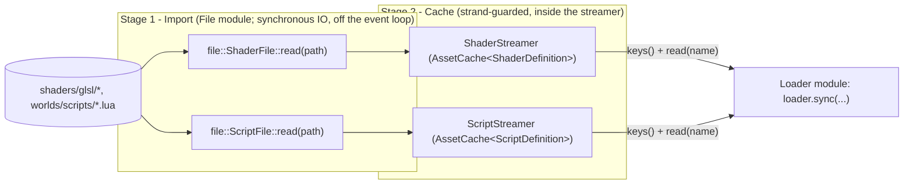

# Asset

Generic Stage 2 (cache) and streaming reference for name-addressed assets
(shaders, scripts, meshes, ...). This module assumes the asset is already in
memory — it never touches disk. Stage 1 (import from disk) lives in `File`;
Stage 3 (upload into a runtime system) lives in `Loader`. Both consume this
module.

| Piece | Role |
|---|---|
| `concepts.hpp` | `AssetDefinition`, `LoadSink`, `LoaderOf`, `DefinitionSource` — the shape every asset type must satisfy |
| `asset_cache.hpp` | `AssetCache<Def>` — thread-safe (strand-guarded) name → `Def` map; also the pool executor streamers fan imports out over. Stays header-only: it's a class template, and this module has no fixed set of `Def` types to explicitly instantiate against |
| `asset_streamer.hpp` | `streamAssets` — the shared parallel-import loop the per-type streamers forward `stream()` to; the read arg and cache key can differ (path in, stem key out), with an identity form for `WorldStreamer` |
| `shader_streamer.hpp` / `script_streamer.hpp` | `ShaderStreamer`/`ScriptStreamer` - hold a stateless `file::ShaderFile`/`ScriptFile` reader + an `AssetCache`, open no file at construction; `stream(files)` imports full paths (fanned over the pool) keyed by stem, `keys()` and `read(name)` feed the matching loader's `sync()` |
| `world_streamer.hpp` / `src/world_streamer.cpp` | `WorldStreamer` — position-streamed `WorldChunk` source backed by a `file::IWorldFile`; a `DefinitionSource` like any streamer |

`AssetCache<Def>::put` is the only writer, gated by `ensureOnStrand()`;
`read()` is lock-free lookup.

Every streamer satisfies `DefinitionSource` structurally — `ShaderStreamer`
and `ScriptStreamer` for their named definitions, `WorldStreamer` for
`WorldChunk` - so each matching loader can sync from the same keys/read shape
without inheriting from anything. Each pulls Stage-1 reads from a
`file::` disk source into its own cache; the match to `DefinitionSource` is
purely structural (duck-typed by the concept). `Loader`, which depends on
both, statically checks it.

## Graph

### Asset pipeline (Stage 2 — this module; Stage 1 in `File`, Stage 3 in `Loader`)

