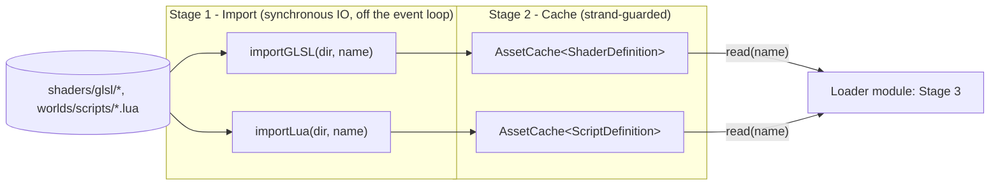

# Asset

Generic Stage 1 (import) / Stage 2 (cache) for static, name-addressed assets
(shaders, scripts, meshes, ...). Stage 3 (upload into a runtime system) lives
in `Loader`, which consumes this module.

| Piece | Role |
|---|---|
| `concepts.hpp` | `AssetDefinition`, `ImporterOf`, `LoaderOf`, `DefinitionSource` — the shape every asset type must satisfy |
| `importers.hpp` / `src/importers.cpp` | `importGLSL`/`importLua` — synchronous file IO, called off the event loop; declared in the header, defined in the `.cpp`. `glslImporter(dir)`/`luaImporter(dir)` stay header-only — they return an unnamed closure type, which can't be declared separately from its definition |
| `asset_cache.hpp` | `AssetCache<Def>` — thread-safe (strand-guarded) name → `Def` map; also the pool executor importers fan out over. Stays header-only: it's a class template, and this module has no fixed set of `Def` types to explicitly instantiate against |

`AssetCache<Def>::put` is the only writer, gated by `ensureOnStrand()`;
`read()` is lock-free lookup. This pair is what `loader::loadAssets<Def>`
(in the `Loader` module) drives end-to-end — see that module's README for
the full pipeline.

`DefinitionSource` is also satisfied structurally by `File`'s `WorldStreamer`
for `WorldChunk` (see that module's README), which is how world streaming
rides the same pipeline shape without inheriting from `AssetCache` or
anything else. Neither module depends on the other for this — `File` never
includes or links `Asset`; the match is purely structural (duck-typed by the
concept). `Loader`, which depends on both, statically checks it.

## Graph

### Asset pipeline (Stage 1 + 2 — this module; Stage 3 in `Loader`)

