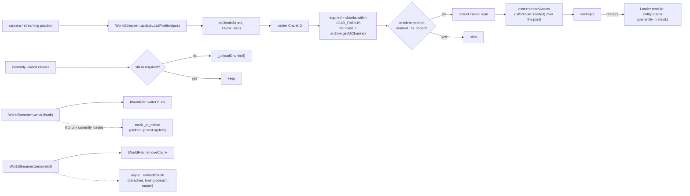
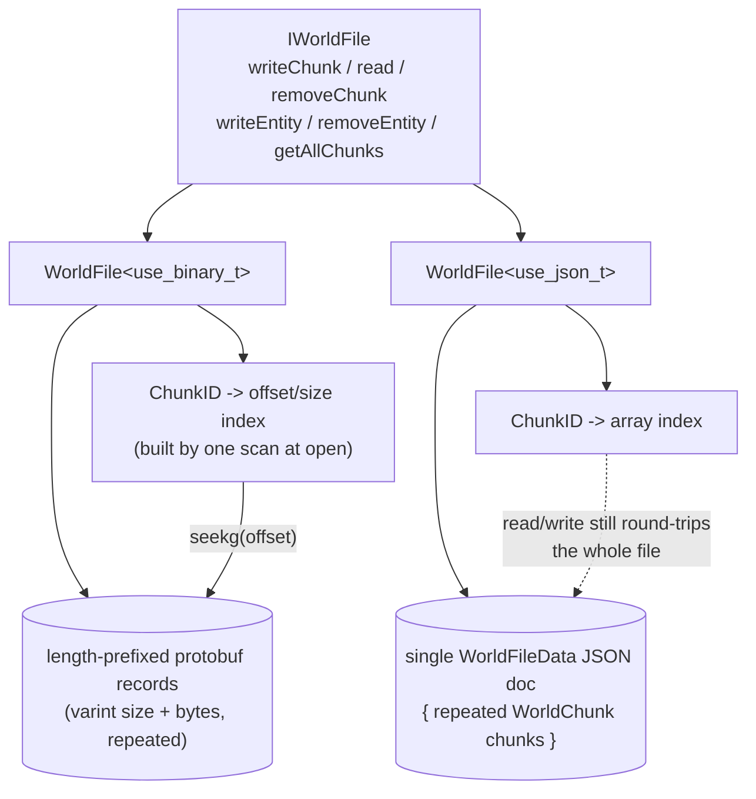

# File

Everything that touches the disk. Two responsibilities:

- **Save archives** (`world_file.hpp`) — `WorldFile<Mode>` reads/writes
  `WorldChunk`s to a level file. This is the disk backend the `Asset` module's
  `WorldStreamer` streams through; the streamer itself (the "which chunks are
  resident" policy) lives in `Asset`, not here.
- **Disk sources** (`shader_file.hpp`, `script_file.hpp`) — Stage 1 of the
  asset pipeline: `ShaderFile`/`ScriptFile` are stateless readers with
  `read(path) -> optional<Def>` (the same source-read shape as
  `WorldFile::read(id)`), naming each definition by `path.stem()`. They read GLSL
  and Lua off disk into protobuf definitions. `Asset` operates on in-memory
  definitions only and never touches disk, so this half lives here; the `Asset`
  module's `ShaderStreamer`/`ScriptStreamer` hold one of these and fan reads over
  the pool (stateless + independent files, so reads are thread-safe).

## `file`: save archive + world streaming

`WorldFile<Mode>` is the on-disk format, chosen at compile time via the
`use_binary`/`use_json` tag types (`data_type.hpp`). Both specializations
implement `IWorldFile`: `read`/write/remove a `WorldChunk` by `ChunkID`, and
read-modify-write a single `EntityDefinition` inside a chunk. `read(id) const`
is the source-read shape (opens a local stream per call, so concurrent reads
are safe) — the write half keeps the shared member stream.

| Mode | Layout | Random access |
|---|---|---|
| `use_binary_t` | `<varint size><chunk bytes>` repeated, no framing between records | in-memory offset/size index (`ChunkIndexEntry`) built by scanning once at construction; reads `seekg` straight to the chunk |
| `use_json_t` | single `WorldFileData{ repeated WorldChunk chunks }` JSON document | in-memory index maps `ChunkID -> array index`, but every write/read still round-trips the *whole* file (no partial JSON I/O) |

`WorldStreamer` sits on top of one `WorldFile` and adds the piece archives
don't have: **which chunks should be resident right now**, driven by a 3D
position. It satisfies `asset::DefinitionSource<WorldStreamer, ChunkID,
WorldChunk>` structurally (has `read(ChunkID) -> const WorldChunk*`) without
inheriting from anything, and without `File` including or linking `Asset`
to say so — the same shape `AssetCache<Def>` satisfies for static assets,
which is what lets `Loader`'s `EntityLoader` treat "read a world chunk's
entities" and "read a cached mesh definition" the same way.

`updateLoadPosition(pos)`:
1. Converts `pos` to a center `ChunkID` (`floor(pos / chunk_size)` per axis).
2. Builds the `required` set: every chunk within `LOAD_RADIUS` (1) that
   actually exists in the archive's `getAllChunks()`.
3. Streams (or reloads, if marked dirty in `_to_reload`) everything in
   `required` not already resident, through the same `asset::streamAssets`
   fan-out the other streamers use (`IWorldFile::read` per chunk, over the pool).
4. Unloads anything resident but no longer in `required`.

`write()` persists through to the archive immediately and, if the chunk is
currently loaded, marks it `_to_reload` so the next `updateLoadPosition`
picks up the change. `remove()` removes from the archive immediately and
detaches an async unload (eviction timing doesn't matter — the caller still
holds a valid pointer to the in-memory copy either way).

## Graphs

### World streaming

### `WorldFile` backends

