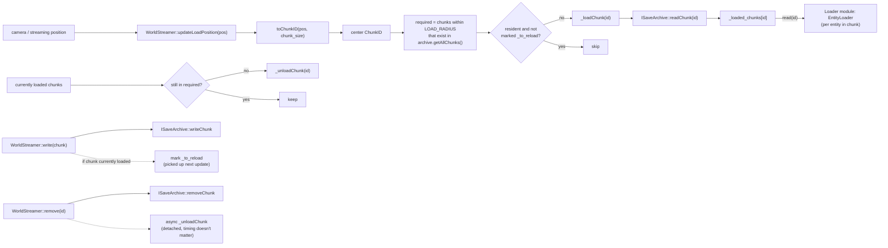
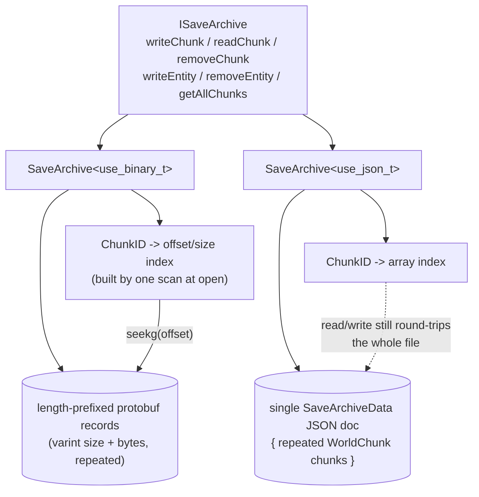

# File

On-disk persistence: `SaveArchive`/`WorldStreamer` for mutable,
position-streamed world state.

This module used to also host the generic import/cache asset pipeline; that
now lives in its own `Asset` module (`asset` namespace, Stage 1 + 2,
consumed by `Loader` for Stage 3 — see that module's README). `File` does
not depend on `Asset`: `WorldStreamer` exposes `read(ChunkID) -> const
WorldChunk*`, the same read shape `AssetCache<Def>` exposes for static
assets, but purely structurally — no shared base type, no include of
`Asset` at all. `Loader`, which already depends on both modules, is where
that structural match (`asset::DefinitionSource`) is actually checked.

## `file`: save archive + world streaming

`SaveArchive<Mode>` is the on-disk format, chosen at compile time via the
`use_binary`/`use_json` tag types (`data_type.hpp`). Both specializations
implement `ISaveArchive`: read/write/remove a `WorldChunk` by `ChunkID`, and
read-modify-write a single `EntityDefinition` inside a chunk.

| Mode | Layout | Random access |
|---|---|---|
| `use_binary_t` | `<varint size><chunk bytes>` repeated, no framing between records | in-memory offset/size index (`ChunkIndexEntry`) built by scanning once at construction; reads `seekg` straight to the chunk |
| `use_json_t` | single `SaveArchiveData{ repeated WorldChunk chunks }` JSON document | in-memory index maps `ChunkID -> array index`, but every write/read still round-trips the *whole* file (no partial JSON I/O) |

`WorldStreamer` sits on top of one `SaveArchive` and adds the piece archives
don't have: **which chunks should be resident right now**, driven by a 3D
position. It satisfies `asset::DefinitionSource<WorldStreamer, ChunkID,
WorldChunk>` structurally (has `read(ChunkID) -> const WorldChunk*`) without
inheriting from anything, and without `File` including or linking `Asset`
to say so — the same shape `AssetCache<Def>` satisfies for static assets,
which is what lets `Loader`'s `EntityLoader` treat "read a world chunk's
entities" and "read a cached mesh definition" the same way.

`updateLoadPosition(pos)`:
1. Converts `pos` to a center `ChunkID` (`floor(pos / chunk_size)` per axis).
2. Builds the `required` set: every chunk within `LOAD_RADIUS` (1) that
   actually exists in the archive's `getAllChunks()`.
3. Loads (or reloads, if marked dirty in `_to_reload`) anything in
   `required` not already resident.
4. Unloads anything resident but no longer in `required`.

`write()` persists through to the archive immediately and, if the chunk is
currently loaded, marks it `_to_reload` so the next `updateLoadPosition`
picks up the change. `remove()` removes from the archive immediately and
detaches an async unload (eviction timing doesn't matter — the caller still
holds a valid pointer to the in-memory copy either way).

## Graphs

### World streaming

### `SaveArchive` backends

