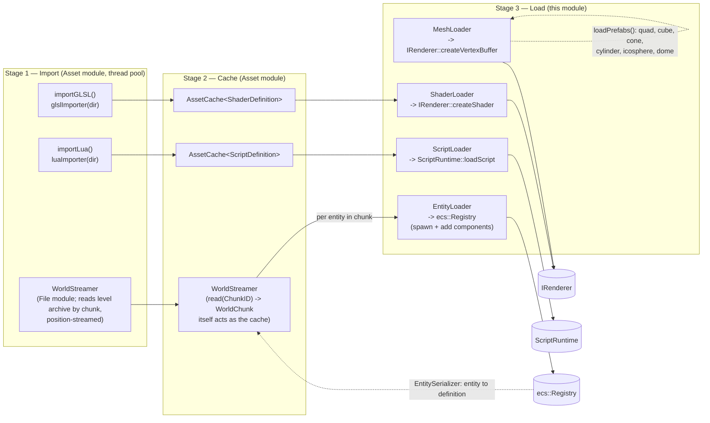

# Loader

Uploads asset definitions (protobuf messages) into their runtime systems:
shaders and meshes into the renderer, scripts into the script runtime,
entities into the ECS registry.

This module is Stage 3 of a three-stage asset pipeline. Stage 1
(import from disk) and Stage 2 (cache) live in the `Asset` module's `asset`
namespace (`importers.hpp`, `asset_cache.hpp`, `concepts.hpp`); `Loader`
only knows how to take an already-built `Def` and push it somewhere.

## Concepts (`asset::concepts.hpp`)

Three concepts glue the stages together generically, so `loadAssets<Def>`
doesn't need a hand-written variant per asset type:

- `AssetDefinition<Def>` — a protobuf message with a `name()`.
- `ImporterOf<F, Def>` — `F(std::string name) -> asio::awaitable<std::optional<Def>>`.
- `LoaderOf<L, Def>` — `L.load(const Def&) -> asio::awaitable<bool>`.
- `DefinitionSource<S, Key, Def>` — `S.read(Key) -> const Def*` (satisfied by
  `AssetCache<Def>`, and by `WorldStreamer` for `WorldChunk`, which is how
  world streaming rides the same pipeline shape without inheriting from it).

## Loaders in this module

| Loader | Definition | Target |
|---|---|---|
| `ShaderLoader` | `proto::render::ShaderDefinition` | `IRenderer::createShader` |
| `MeshLoader` | `proto::render::MeshDefinition` | `IRenderer::createVertexBuffer` (also builds built-in prefabs: quad, cube, cone, cylinder, icospheres, dome) |
| `ScriptLoader` | `proto::script::ScriptDefinition` | `script::ScriptRuntime::loadScript` |
| `EntityLoader` | `proto::ecs::EntityDefinition` | `ecs::Registry` (spawns entity, attaches components) |
| `EntitySerializer` | — (reverse direction) | `ecs::Registry` entity → `EntityDefinition` |

`EntitySerializer` is the one asymmetric piece: it goes registry → definition,
for saving world state back out, rather than definition → runtime.

## The pipeline function: `loader::loadAssets`

```cpp
loader::loadAssets<Def>(names, importer, cache, loader);
```

For a batch of names this drives all three stages:

1. **Import** every name concurrently, fanned out over the cache's executor
   (thread pool) via `asio::experimental::make_parallel_group`.
2. **Cache** each imported `Def` under its name (`AssetCache::put`).
3. **Load** each cached `Def` into the runtime system, sequentially, reading
   back through `cache.read(name)`.

Any import failure or exception aborts the whole call. Misusing it (wrong
importer/loader for `Def`) is a compile error naming the failed concept, not
a runtime surprise.

Entities don't go through `loadAssets` — they come from `WorldStreamer`
chunks and are pushed straight to `EntityLoader::load` per entity (see
graph below), since chunk membership is streamed by camera position, not by
a fixed list of names.

## Full asset loading pipeline



Everything above `loadAssets<Def>` is the same generic call, parameterized
only by `Def`/`Importer`/`Loader` — see `game/src/main.cpp` and
`editor/src/main.cpp` for the call sites (shaders, scripts; meshes load via
`loadPrefabs()`, entities via the world-streamer loop each frame).
