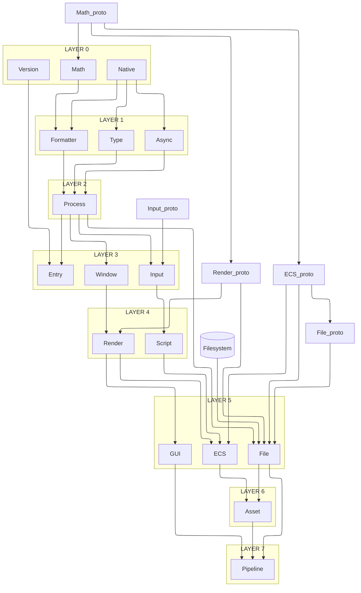

# Modules

## Simplified modules architecture

```mermaid
---
config:
  layout: elk
---
flowchart TD
 subgraph subGraph0["LAYER 0"]
        Math["Math"]
        Native["Native"]
        Version["Version"]
  end
 subgraph subGraph1["LAYER 1"]
        Async["Async"]
        Type["Type"]
        Formatter["Formatter"]
  end
 subgraph subGraph2["LAYER 2"]
        Process["Process"]
  end
 subgraph subGraph3["LAYER 3"]
        Input["Input"]
        Window["Window"]
        Entry["Entry"]
  end
 subgraph subGraph4["LAYER 4"]
        Render["Render"]
        Script["Script"]
  end
 subgraph subGraph5["LAYER 5"]
        ECS["ECS"]
        GUI["GUI"]
        File["File"]
  end
 subgraph subGraph6["LAYER 6"]
        Asset["Asset"]
  end
 subgraph subGraph7["LAYER 7"]
        Pipeline["Pipeline"]
  end
    id1[("Filesystem")] --> File
    Math_proto["Math_proto"] --> Math & Render_proto["Render_proto"] & ECS_proto["ECS_proto"]
    ECS_proto --> File_proto["File_proto"] & ECS & File
    Input_proto["Input_proto"] --> Input
    Render_proto --> Render & File
    File_proto --> File
    Native --> Async & Type & Formatter
    Math --> Formatter
    Async --> Process
    Type --> Process
    Formatter --> Process
    Process --> Input & Window & Entry & File
    Version --> Entry
    Window --> Render
    Input --> Script
    Script --> ECS
    Render --> ECS & GUI
    ECS --> Asset
    File --> Asset & Pipeline
    Asset --> Pipeline
    GUI --> Pipeline


```
